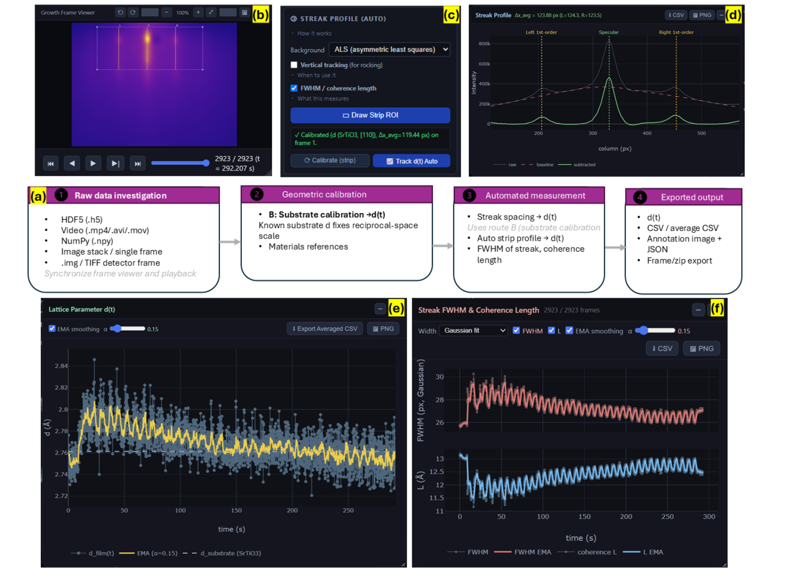
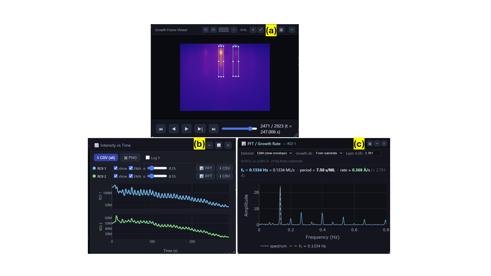
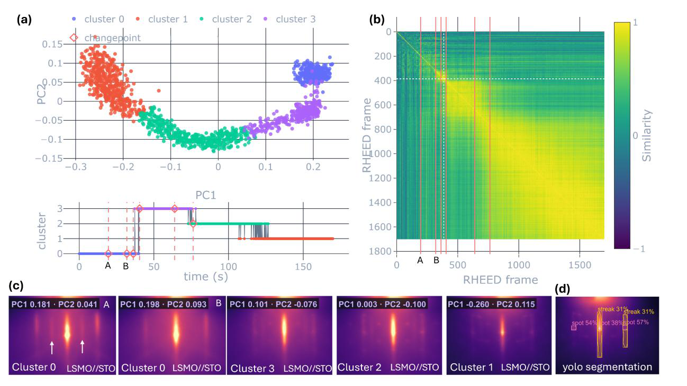

# Auto RHEED

A browser-based analysis suite for **Reflection High-Energy Electron Diffraction (RHEED)** data, built for thin-film growth researchers (MBE / PLD). Auto RHEED turns raw growth videos into quantitative, time-resolved physics (pixel calibration, angle of incidence α, in-plane lattice parameter *d*(t), streak coherence length, and diffracted-intensity growth rates) through an interactive interface and a matching programmatic API.

Developed at Oak Ridge National Laboratory (ORNL).

---

## Features

- **Multi-format loading**: HDF5 (`.h5`), video (`.mp4/.avi/.mov/.mkv`), NumPy (`.npy`), single images, or a folder of per-frame images stacked into one video; raw `.img` / TIFF detector frames supported.
- **Calibration**: 5-point screen calibration (pixel scale + α) and substrate calibration via `d = λL/Δx` (relativistic electron wavelength), with reference *d* from a built-in table, the Materials Project (your own free API key), or a custom value.
- **Peak tracking & α(t)**: track specular / direct-beam positions frame-by-frame to follow angle-of-incidence evolution, with an optional intensity-vs-α view.
- **Lattice parameter d(t)**: automatic strip-profile tracking (ALS / rolling-ball / polynomial / moving-min background subtraction) with sub-pixel peak detection.
- **Streak FWHM & coherence length**: specular-streak width (Gaussian fit or half-max) converted to in-plane coherence length, evolving per frame.
- **Intensity vs time & growth rate**: per-ROI intensity oscillations (stacked, EMA-smoothed) and per-ROI FFT giving growth rate (ML/s), period, and deposition rate (Å/s).
- **Library**: a persistent reference gallery of RHEED patterns by substrate.
- **Publication-ready export**: every chart exports to CSV and to PNG with selectable font size and **600 DPI** (embedded); the frame viewer exports high-resolution annotated images.
- **Colormaps**: perceptually-uniform Viridis/Plasma/Inferno/Magma and colorblind-safe Cividis, among others.

---

## How it works

### Structural monitoring: lattice parameter, streak width & coherence length



The analysis proceeds in four stages: **(a)** raw-data ingestion, **(b)** a synchronized
frame viewer and playback timeline, **(c–d)** a single geometric calibration, and per-frame
structural measurement. On the first bare-substrate frame the user marks a known substrate
reflection; the measured streak separation Δx fixes the pixel-to-reciprocal-space scale
through the small-angle RHEED relation `d = λL/Δx` (here SrTiO₃ along [110]). A strip ROI
spanning the specular spot and the two first-order streaks is summed column-wise into a 1-D
profile **(d)**; a slowly varying background is removed (asymmetric least squares shown), and
the specular and ±1 peaks are detected and refined to sub-pixel precision. Averaging the two
specular-to-first-order distances gives Δx per frame, converted to the in-plane lattice
parameter **d(t)** **(e)**, resolving monolayer-periodic oscillations on a slow relaxation
toward the substrate value. From the same profiles, the specular streak's **FWHM** and the
derived in-plane **coherence length L** are tracked every frame **(f)**, reporting the periodic
sharpening and broadening of the diffraction features as each layer nucleates and coalesces.

### Kinetic monitoring: intensity oscillations & growth rate



The diffracted intensity itself carries the most direct signature of layer-by-layer growth.
**(a)** Rectangular ROIs are placed on distinct diffraction features (specular spot and an
adjacent streak) and integrated frame-by-frame. **(b)** The resulting intensity transients are
plotted as time-synchronized panels, both showing pronounced periodic oscillations on a slow
decay, since one full oscillation corresponds to the completion of a single atomic layer.
**(c)** A discrete Fourier transform of each transient (after an EMA detrend) yields a sharp
fundamental at `f₀` that is directly the growth rate (ML/s); combined with the out-of-plane
interlayer spacing from the substrate calibration it gives an absolute deposition rate (Å/s).
A separate FFT window can be opened per ROI to compare rates from different features.

*(These correspond to Figures of the associated manuscript.)*

### AI inference: unsupervised phase discovery and object detection



Because the analysis core is fully scriptable, the same routines can be driven by AI
agents (through the MCP server) to reason about growth state without manual ROI setup.
**(a)** Each RHEED frame is reduced to a feature embedding and projected with PCA; an
unsupervised clustering labels distinct growth regimes (clusters 0 to 3), and changepoint
detection marks the transitions. The lower strip shows the resulting cluster and PC1
timeline over the run. **(b)** A frame-to-frame similarity matrix exposes the block
structure of the growth (bright yellow blocks are self-similar regimes); the red lines mark
the detected changepoints (A, B). **(c)** Representative frames sampled from each cluster
(LSMO//STO), annotated with their PC1/PC2 coordinates, show how the diffraction pattern
evolves between regimes. **(d)** A YOLO object-detection model segments the pattern into
labelled streaks and spots with confidence scores, giving structured, machine-readable
features for automated decision-making.

Together these turn a raw RHEED video into a timeline of discrete, labelled growth states,
the kind of high-level observable an autonomous growth controller can act on. See the
[associated preprint](https://arxiv.org/abs/2609.15922) for full detail.

---

## Installation

Requires **Python ≥ 3.10**. From the project root:

```bash
pip install -e .
```

This installs the runtime dependencies (NumPy, SciPy, OpenCV, h5py, Flask, mcp).

---

## Running the app

```bash
python -m rheed_webapp.app
```

Then open **http://localhost:5000** (set `PORT` to use a different port). The frontend is a single self-contained page; just refresh the browser to pick up template changes.

### Desktop shortcut (Windows)

For a one-click launch, either:

- Double-click **`Launch Auto RHEED.bat`** (starts the server and opens your browser), or
- Run **`Create Desktop Shortcut.bat`** once to add an *Auto RHEED* icon to your Desktop, or
- Open the app and use **About → Create Desktop Shortcut**.

---

## Project structure

```
src/
  rheed_core/      # All RHEED physics; no Flask. Owns the dataset + math.
    session.py         # frame render, ROI intensity, calibration, tracking, strip_track
    streak_profile.py  # strip-sum profiles, background subtraction, peaks, FWHM
    spectra.py         # intensity FFT -> growth rate
    library.py         # RHEED Library storage
    materials.py       # substrate lattice constants + zone-axis geometry
    calibration.py, wavelength.py, constants.py, io/
  rheed_webapp/    # Thin Flask routes + the single-page frontend (templates/index.html)
  rheed_mcp/       # MCP server exposing the core to AI agents
```

`rheed_core` never imports Flask; the web app and the MCP server are independent
consumers of the same analysis core, which makes every measurement scriptable and
usable inside automated / agentic growth workflows.

---

## MCP server

An [MCP](https://modelcontextprotocol.io) server (`src/rheed_mcp/server.py`) exposes
the analysis core to AI agents so the same routines available in the GUI can be
driven programmatically.

---

## Data availability

Example RHEED datasets are large and are **not** included in this repository; they
are archived separately (see the dataset DOI here:https://doi.org/10.5281/zenodo.22755689 ).

## Citation

If you use Auto RHEED in your research, please cite the associated paper
*(citation / DOI:https://arxiv.org/abs/2609.15922)*.


## Acknowledgments

This work was supported by the Center for Nanophase Materials Sciences (CNMS), a US
Department of Energy Office of Science User Facility at Oak Ridge National Laboratory.
